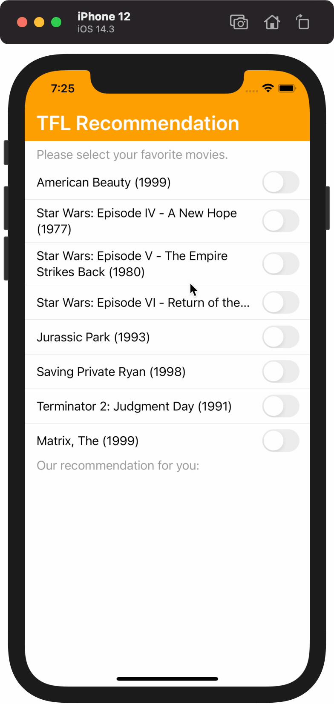

# On-device Recommendation with TFLite and SwiftUI

This is a reimplementation of the android app mentioned in the [tensorflow/example](https://github.com/tensorflow/examples/tree/master/lite/examples/recommendation/android) repo with SwiftUI.

<p align="center">
  
</p>

There is also an [official blog](https://blog.tensorflow.org/2020/09/introduction-to-tflite-on-device-recommendation.html) about the  model.

To use this repo, please make sure you already have Cocoapod installed. If so, please run:

```bash
pod install
Recommendation.xcworkspace
```

Notice that there seems to be some issue with the `.tflite` file provided in the [tensorflow/example](https://github.com/tensorflow/examples/tree/master/lite/examples/recommendation/android). If you feel like to retrain the model, please follow the instructions [here](https://github.com/tensorflow/examples/tree/master/lite/examples/recommendation/ml).